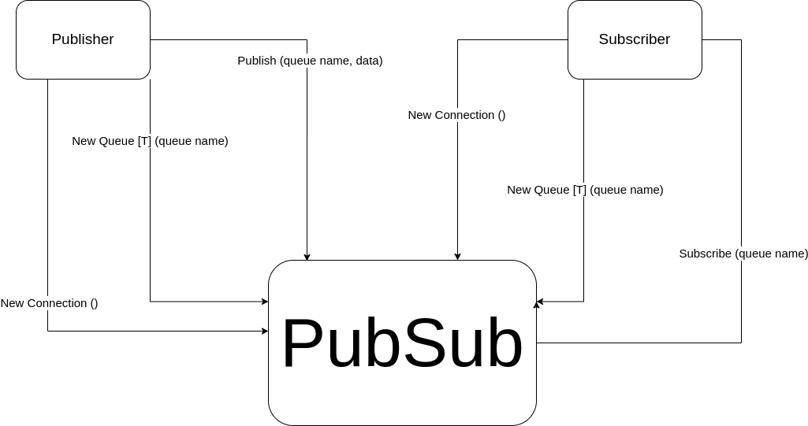

# Development Diary

After drawing an initial sketch of the pub/sub architecture¹, I knew how I would approach most of the system design, but some questions came up, including:

1 - What would be the use of registering the messages from each queues in files?
2 - How to make the best use of Go concurrency to create the system?
3 - How to correctly add Generics to the architecture?
4 - Should I implement a complex system which covers the communication between processes (so that a subscriber and a publisher can be created separately)?

I decided to create the initial `PubSub` type with simple tests and functions without thinking of Generics, files and different processes.

After creating the initial project, I decided not to deal with processes communication. It would require me to deal with low level TCP connections, gRPC, unix sockets or WebSockets, which doesn't make sense in the scope of the project.

I decided then to deal with the file management next. Simply logging each message into a simple file for each queue is the simplest and smartest way to approach that feature. I should simply add the message and the timestamp of when it was sent.

After adding the simple logger functionality, I decided not to use generics until I have finished other tasks that I have pending. We'll see if I have time later.